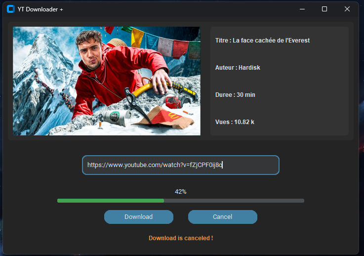

# 🚀 YT Downloader Plus



**YT Downloader Plus** est une application de bureau moderne et intuitive conçue pour télécharger facilement des vidéos et de l'audio depuis YouTube. Grâce à une interface graphique fluide (CustomTkinter), l'utilisateur bénéficie d'un contrôle total sur la qualité de ses téléchargements.

## ✨ Fonctionnalités (Version 2.0)

### 📥 Téléchargement Flexible
* **Vidéo Haute Qualité** : Sélectionnez la résolution souhaitée (ex: 1080p, 720p) parmi les flux disponibles.
* **Extraction Audio** : Option dédiée pour télécharger uniquement la piste audio (format adapté pour le MP3/abr).
* **Multi-format** : Gestion intelligente des flux progressifs (MP4) pour une compatibilité maximale.

### 🔍 Prévisualisation & Détails
* **Analyse Instantanée** : Dès que l'URL est collée, l'application récupère automatiquement :
    * Le titre de la vidéo.
    * Le nom de l'auteur (chaîne).
    * La durée de la vidéo.
    * Le nombre de vues.
    * La miniature (thumbnail) en haute résolution.

### 🛠️ Contrôle & Expérience Utilisateur
* **Gestion du Dossier** : Choisissez précisément le répertoire de destination pour vos fichiers.
* **Progression en Temps Réel** : Barre de progression et indicateur de pourcentage pour suivre l'avancement.
* **Annulation Intelligente** : Possibilité d'interrompre un téléchargement en cours avec suppression automatique du fichier partiel pour éviter les fichiers corrompus.
* **Robustesse** : 
    * Nettoyage automatique des caractères spéciaux dans les noms de fichiers pour éviter les erreurs système.
    * Gestion d'erreurs détaillée (Lien invalide, vidéo indisponible, etc.) avec feedback visuel (couleurs rouge/orange/vert).

---

## 🛠️ Installation & Configuration

### Prérequis
* **Python 3.x**
* Les bibliothèques suivantes (installables via pip) :
  ```bash
  pip install customtkinter pytube requests Pillow
  ```

### Utilisation
1. Lancez l'application :
   ```bash
   python YTdownloader.py
   ```
2. Collez l'URL YouTube dans le champ de saisie.
3. Attendez l'affichage des détails de la vidéo.
4. Sélectionnez la **qualité vidéo** ou l'**option audio**.
5. (Optionnel) Cliquez sur **"Choisir le dossier"** pour changer la destination.
6. Cliquez sur **"Download"** et suivez la progression !

---

## ⚙️ Technologies Utilisées
* **Interface Graphique** : `CustomTkinter` (UI moderne et adaptative).
* **Moteur de téléchargement** : `pytube` (extraction des flux YouTube).
* **Traitement d'images** : `Pillow` & `requests` (gestion des miniatures).
* **Concurrence** : `threading` (pour garantir une interface fluide et non bloquante).

---

*Note : L'interface utilisateur ayant évolué avec la V2.0, la capture d'écran (img/image.png) devra être mise à jour pour refléter les nouvelles options de sélection.*