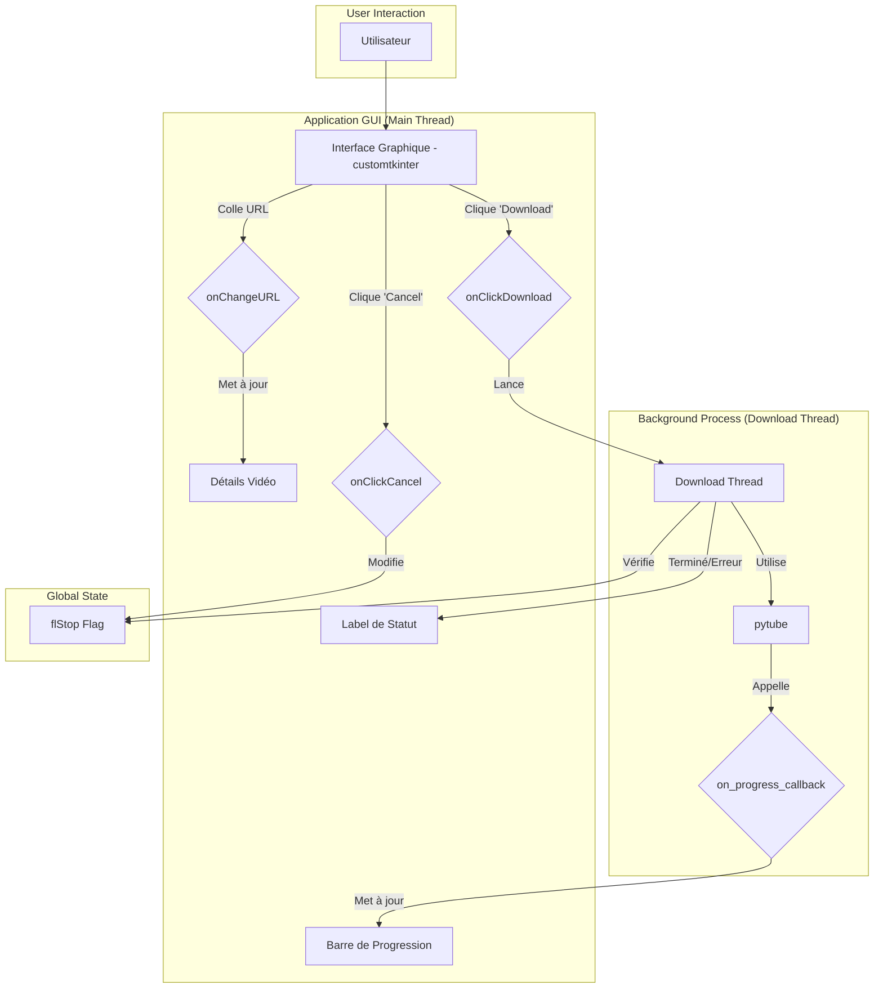

# Architecture Technique : YT Downloader Plus

## 1. Introduction

L'application est une application de bureau monolithique écrite en Python. Elle utilise `CustomTkinter` pour son interface graphique et s'appuie sur un thread séparé pour gérer le téléchargement afin de ne pas bloquer l'interface utilisateur.

## 2. Diagramme d'Architecture

## 3. Composants Principaux

### Interface Utilisateur (GUI)
Construite avec `CustomTkinter`, l'interface est contenue dans le script `YTdownloader.py` et s'exécute sur le thread principal. Elle est responsable de la capture des entrées utilisateur et de l'affichage de l'état du téléchargement.

### Logique de Téléchargement
La bibliothèque `pytube` gère toute l'interaction avec YouTube. La fonction `download()` utilise `ytObject.streams.get_highest_resolution()` pour récupérer le flux vidéo de la plus haute qualité et le télécharge.
Pour éviter les erreurs système, le titre de la vidéo est nettoyé via une fonction `sanitize_filename` avant d'être utilisé comme nom de fichier. Cela garantit que les caractères non valides sont supprimés, rendant la création et la suppression de fichiers fiables.

### Gestion des Threads
Pour garantir que l'interface utilisateur reste réactive pendant le téléchargement (qui peut être long), la fonction `onClickDownload` lance le processus de téléchargement dans un thread séparé (`threading.Thread`).

### Mécanisme d'Annulation
Un drapeau global (`flStop`) est utilisé pour communiquer entre le thread principal et le thread de téléchargement. Lorsque l'utilisateur clique sur "Cancel", le thread principal met `flStop` à `True`. Le thread de téléchargement vérifie périodiquement l'état de ce drapeau et, s'il est `True`, lève une exception pour interrompre le processus et supprime le fichier partiellement téléchargé.

## 4. Packaging
Le fichier `app_v1.spec` est une configuration pour `PyInstaller`. Il est utilisé pour packager le script Python et toutes ses dépendances (comme `customtkinter`) en un seul fichier exécutable pour une distribution facile.

## 5. Dépendances Externes
- `customtkinter`
- `pytube`
- `requests`
- `Pillow`
